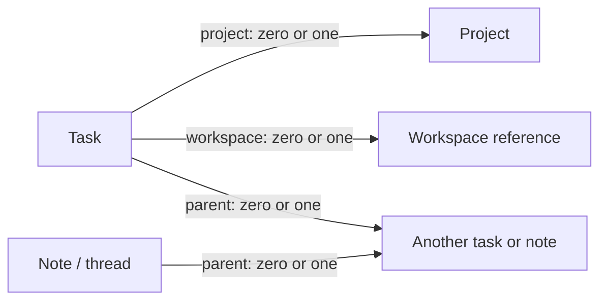

> Current storage update (2026-09-15): one Markdown per independent task/note,
> with all subtabs embedded. Read `lab migrations assistant-subtabs` for the
> exact contract. The original separate-record design below is migration history.

> Implementation status: schema 2 storage and migration are available through
> `lab assistant migrate --dry-run` and `lab assistant migrate --apply`.
> The implementation preserves IDs, original bodies, old-path aliases, backups,
> typed parent links, and independent project/workspace references. The UI has
> nested document tabs, project/workspace properties and filters, and creation
> controls. Optional SQLite caching, drag ordering, and a dedicated workspace
> task panel remain future extensions; they are not required to read the data.

# Assistant: independent tasks, notes, and projects

Status: proposed architecture. The current unified list and neutral controls are
implemented; this document specifies the next storage and document-tree redesign.
Existing records have not been migrated by this proposal.

## Product model

A task is an individual unit of work, independent of where its file lives and
where someone happens to work on it.

- A task can reference zero or one project and zero or one workspace.
- A project can include tasks associated with different workspaces.
- A workspace can display tasks from different projects.
- Neither relationship owns the task or determines its storage path.
- Opening a terminal or resolving a task somewhere else does not automatically
  change its workspace reference.
- Task documents contain a tree of tabs: executable subtasks and supporting
  notes/threads. These are records with identities, not opaque sections hidden
  in one large document.



Each task/note has at most one parent, so the document structure is a tree.
Project membership and workspace association are separate from that tree.

## What the user sees

### Tasks

One list, all workspaces by default. Search, Project, Workspace, Status, Priority,
and the existing planning views filter that same set of tasks. A project or
workspace never creates a separate task database. Workspace and project labels
are quiet text. Routine status/priority labels use neutral colors.

Subtasks remain independently searchable and filterable. When shown in the main
list, they carry a short parent breadcrumb. A workspace view includes a matching
subtask even when its parent belongs to another workspace. This prevents work
from disappearing because its parent does not match a filter.

Selecting a row opens its containing document tree and selects that exact task.
Counts count each task record once; notes/threads do not inflate task counts.

### Inside a task or note

Replace the current large document cards with a tab tree in the existing left rail:

```text
Task overview
▾ Research                 note
    Comparisons            note
▾ Prepare draft            subtask · ready
    Decisions              thread
  Final review             subtask · inbox

+ Add tab
```

The root overview is the main record's body. Children are small, indented rows
with disclosure controls, a neutral active background, and an overflow menu.
Do not repeat the large task title, metadata blocks, or card borders in the rail.

`Add tab` offers Subtask and Note/thread. A subtask has status, priority, and dates;
a note/thread has content without a task lifecycle. Both can contain sub-tabs.
Threads are authored notes, not an implied chat or auto-sending channel.

Required interactions: create a child, select, rename, reorder siblings, move to
another parent, collapse/expand, and archive. Reordering/moving must have keyboard
menu actions as well as any drag gesture. A move preserves identity and explicit
project/workspace associations. Invalid cycles are rejected. Broken parent links
appear in an Unlinked section with a repair action rather than disappearing.

The top bar edits the selected record's metadata. It includes Project and
Workspace, with None available. Recurrence stays in this bar: Once, Weekly,
Monthly, Yearly. Main copy actions have 36px targets; section-copy and metadata
controls have at least 32px targets. Content fills the main pane.

When creating a child, the form may prefill its parent's project/workspace as a
convenience. These become explicit values on save. Later parent edits never
silently propagate membership changes to children.

### Workspace convenience view

Add an Assistant-backed Tasks tab when viewing a real Lab workspace. It reuses
the same list and document renderer with that workspace reference preselected.
Project, state, priority, and search can narrow it further. An All tasks action
opens the global Assistant view.

Editing or completing a task here changes the original Assistant record. There
is no workspace-local copy, no new tasks.json, and no requirement to run the
task from that workspace. Deleting or losing access to a workspace never deletes
the associated tasks. Existing Assistant access controls still apply.

### Projects and notes

A small project selector offers Create project. A project needs only a name and
optional description. Its detail view is a filtered task/note view with project
context, not another storage location.

Notes use the same record/parent system. Existing meeting notes become typed
notes; their summary, supporting notes, questions, generated documents, series
history, and immutable originals must remain available. There is no separate
meeting-only ownership model underneath the shared UI.

## Canonical storage

```text
assistant/
  AGENTS.md
  README.md
  tasks/
    <task-id>.md            # roots and subtasks together
  notes/
    <note-id>.md            # notes, threads, meetings, and meeting series
  projects/
    <project-id>.md         # business projects, independent of Lab workspaces
  .assistant/
    manifest.json          # format version and migration state
    workspaces.json        # symbolic references to Lab workspaces
    assets/<record-id>/    # only Assistant-owned originals/attachments
    cache/index.sqlite     # disposable, rebuildable lookup index
    migrations/<run-id>/   # journal and verified path/ID mapping
    backups/<run-id>/      # original bytes for recovery
```

Filenames use stable IDs and do not change when titles, project, workspace, or
parent change. New IDs are UUID-based with readable type prefixes. Existing IDs
can be retained when unique within their entity type. References are typed so a
legacy task ID and a note ID with the same text cannot collide.

Tasks and notes stay flat in their respective folders. The nesting the user sees
comes from `parent`, not directory nesting. Moving a tab updates one relationship;
it does not move files or invalidate links.

Generated code, images, videos, and other project assets stay in their owning
workspace/project. `.assistant/assets` is only for content owned by Assistant,
such as an original meeting transcript or an attached image provided to a note.

## Single source of truth

Each Markdown file contains its metadata in frontmatter and its content in the
body. There is no parallel editable JSON copy of tasks, notes, or projects.

JSON is appropriate for the small format manifest and workspace-reference
registry, which have no corresponding user-authored Markdown body. The SQLite
index is a cache of records, aliases, relationships, and search fields; deleting
it must never lose data. Rebuild it from the files and registry. If the database
is versioned with Git, keep the manifest, workspace registry, and owned assets
tracked; ignore only caches, staging data, and local migration backups.

Read and write frontmatter as a real structured format. Use JSON-compatible YAML
values for agent interoperability and a parser/writer that supports multiline
content, arrays, nested references, and unknown fields. Targeted field edits must
preserve the Markdown body and unrelated metadata, including unknown extensions.
Do not retain the current global `project` → `workspace` translation for v2 files.

### Task example

```yaml
---
schema: 2
id: task_2ce25f1b
type: task
title: Prepare launch draft
status: ready
priority: P2
project: project_f83a1d20
workspace: workspace_9b6ae207
parent: {type: task, id: task_113c7701}
position: 200
due: null
scheduled: null
recurrence: null
created: "2026-09-15T18:00:00Z"
updated: "2026-09-15T18:00:00Z"
aliases: ["projects/legacy/subtasks/old-id.md"]
---

# Context

Draft the launch announcement.
```

Examples shorten IDs for readability; new generated IDs use full UUIDs. Existing
scheduling, completion, ownership, tags, dependency, review, and waiting fields
remain supported. `group` remains a legacy label until explicitly mapped to a
real project; migration must not guess that every group is a project.

### Note/thread example

```yaml
---
schema: 2
id: note_c56c7ef9
type: note
note_type: thread
title: Decisions
parent: {type: task, id: task_2ce25f1b}
position: 100
project: project_f83a1d20
workspace: null
created: "2026-09-15T18:00:00Z"
updated: "2026-09-15T18:00:00Z"
---

# Decisions

Record the discussion and its outcome here.
```

Supported note types: plain, thread, meeting, question, document, series. Types
select available metadata and presentation; they do not introduce separate
databases. A meeting can reference a series note. An original transcript is a
create-only resource with its original bytes and hash preserved.

### Project example

```yaml
---
schema: 2
id: project_f83a1d20
type: project
title: Launch
status: active
created: "2026-09-15T18:00:00Z"
updated: "2026-09-15T18:00:00Z"
---

# Context

Purpose and project-wide decisions.
```

Projects do not store authoritative task arrays. Membership is derived from
each task/note's `project` field. The same rule applies to children and workspaces:
store the forward reference once, derive inverse lists through the index.

## Identity and reference rules

| Relationship | Canonical reference | Rule |
| --- | --- | --- |
| Task → project | Project ID or null | At most one; no physical ownership |
| Task → workspace | Workspace-reference ID or null | At most one; association only |
| Task/note → parent | Typed task/note ID or null | At most one; no cycles |
| Meeting → series | Series-note ID or null | Series type required |
| Task → dependencies | Typed task IDs | No self-dependency; report broken links |
| Document → document | Typed record ID | Route resolves ID to the current file |
| Document → external resource | Typed file/URL resource | Explicit origin and location |

Workspace references receive their own stable ID. The registry stores the display
name, Lab vault ID and workspace ID when available, and last-known absolute path.
Names and paths are descriptive/resolution data, never the reference's identity.
A user can retain an unresolved or symbolic workspace reference. Resolution must
not silently choose another workspace with the same name or basename.

For an actual Lab workspace, resolve by vault + stable workspace identity, then
refresh the last-known path after a verified move/rename. If identity is not
available in legacy data, use its exact mapped absolute path and require an
explicit relink when it becomes ambiguous. No basename matching.

New links use record IDs, for example `?view=assistant&task=task_<uuid>`. Legacy
path URLs continue to resolve through per-record `aliases`. Changing project,
workspace, title, or parent leaves those URLs working.

Structured external file references carry a resource ID, label, workspace
reference plus relative path when available, and optional last-known absolute
path/hash. URLs remain explicit URLs. Renaming/moving a resource never causes a
silent search-and-open of a similarly named file. Show a relink action if the
recorded target cannot be resolved.

Body links and embedded images must also survive migration. Inventory their
original targets and preserve the old relative-resolution context or an explicit
per-record source-to-resource mapping. Do not rewrite arbitrary Markdown using a
regular expression. Raw note originals are never rewritten at all.

## Consistency and lifecycle

- Read fresh metadata before edits and use compare-and-swap for changed fields.
- Write through a temporary file and atomic rename. Serialize structural updates
  across CLI and API, including parent moves, reorder, and reference changes.
- Validate target entity types, duplicate IDs, missing targets, and parent cycles.
- Order siblings by `position`, with ID as deterministic tie-breaker. If ranks
  need rebalancing, commit the affected sibling set under the structural lock.
- Completing a task requires its descendant tasks and legacy checkboxes to be
  complete, including task descendants beneath note tabs. Notes themselves have
  no completion status and never independently block a task.
- Reopening a descendant must not silently leave an ancestor falsely marked
  complete: reopen completed ancestors as part of the same reviewed operation,
  or reject with a concrete explanation. Choose one behavior consistently in UI
  and CLI; the recommended behavior is an explicit reopen-ancestors action.
- Archiving a project/workspace preserves its tasks and notes. Deleting a parent
  with children requires explicit reparent/archive handling; no cascading loss.
- Treat broken references as visible repairable records, not reasons to omit
  data from the list. Direct agent edits must remain observable through reindex.

## API, CLI, and rendering boundary

Use one record resolver for APIs, CLI, links, assets, and the document tree.
Do not let each endpoint infer identity from folder depth or workspace ownership.

The resolver accepts a typed ID or validated legacy alias, returns the canonical
record, and enforces Assistant-root and asset-root boundaries. A file path is
not permission to read an arbitrary external file. Cached lookups are validated
against their source files before mutation.

The list response includes projects, workspace references, task rows, and parent
breadcrumbs. Detail returns the selected record and ordered tree nodes. The UI
uses one reusable renderer for global Assistant and workspace-scoped projections.
Metadata, tab creation, reparenting, and ordering use narrow validated operations.

CLI support should include optional `--project`/`--workspace` on task creation,
project add/list/show, note/thread creation, typed parent assignment, tree display,
workspace relinking, reindex, migration dry-run, and migration verification. Keep
legacy commands as compatibility aliases where their meaning remains clear.

## Migration design

The current database uses legacy `projects/<id>/project.md` mappings and nested
task/subtask/meeting collections. The existing parser translates `project` into
`workspace`, and several routes validate exactly four path segments. These are
explicit compatibility boundaries to replace, not conventions to reuse for v2.

1. Inventory every source file, identity, relationship, link, attachment, and hash.
   Report duplicate IDs, unresolved parents, ambiguous workspace mappings, and
   unsupported metadata. Do not create business projects from directory names.
2. Add a version-aware resolver and v2 reader/writer with legacy read support.
   New `project` fields mean business projects only in v2; legacy translation is
   limited to known v1 records.
3. Build a dry-run mapping from every legacy record/path to its canonical record.
   Preserve unique IDs; resolve any collision explicitly and retain old aliases.
   Convert legacy workspace mappings into symbolic workspace references. Preserve
   their exact paths and names, even if a target is currently unavailable.
4. Convert tasks/subtasks into `tasks/`, meetings/series/questions/documents into
   typed `notes/`, and original attachments into record-owned asset locations.
   Preserve task states, timestamps, recurrence history, unknown metadata, body
   content, sibling order where known, and every original byte stream.
5. Stage the new layout and verify counts, hashes, relationship reachability,
   image/resource resolution, and old URL aliases. Preserve the original snapshot
   and a journal outside active collections. Compare source hashes again before
   cutover so intervening edits are not overwritten.
6. Enter a short migration maintenance state for CLI/API writes, promote the
   staged files using a restartable journal, and atomically publish the v2
   manifest only after verification. A partial promotion must remain recoverable
   from the journal and verified original snapshot; never expose a half-read v2
   database as an empty list.
7. Verify in the running app and update its AGENTS.md/README contract. Keep old
   deep links resolving through aliases and retain the backup for recovery.

A migration is complete only when every input file is accounted for. Unsupported
or damaged records remain visible in an explicit migration report; no silent skip.

## Acceptance scenarios

- A project has tasks in two workspaces; all appear under the project filter.
- A workspace has tasks from two projects; all appear in its Tasks tab.
- An unassigned task is fully functional and appears in the global list.
- Changing a task's project/workspace moves no file and breaks no URL.
- Renaming a workspace refreshes its reference only after exact identity matches.
- A parent, nested subtask, and note/thread can each be opened by stable ID.
- A cross-workspace subtask is visible in its own workspace regardless of parent
  location and still participates in parent completion checks.
- Reorder, reparent, archive, missing-parent repair, and cycle rejection behave
  consistently through UI, CLI, and direct-file reindexing.
- The sidebar displays nested tabs and comfortable controls without large cards
  or duplicated metadata.
- Ordinary task/note edits preserve content and unknown frontmatter fields.
- Existing recurrence periods, meeting series, originals, images, and old links
  survive migration. Deleting the cache followed by rebuild yields the same data.
- An interrupted migration can resume or restore the verified original layout.

## Implementation sequence

1. Versioned records, reference registry, resolver, validators, and rebuildable index.
2. Dry-run migration with round-trip fixtures and recovery tests.
3. Project/workspace metadata controls and combined filters.
4. Shared tab tree for tasks and notes, including child creation and movement.
5. Workspace Tasks projection through the shared renderer.
6. Verified data migration, refreshed client instructions, and live acceptance QA.

This sequence keeps data correctness ahead of the visual tree and makes each
stage independently reviewable without treating a new sidebar as a completed
storage redesign.

## Embedded subtabs, Index, and derived progress

The client now uses `document_format: embedded-subtabs-v1` inside schema 2.
Root task/note files retain their IDs. Subtab metadata is a frontmatter `tabs`
array; matching body markers preserve each subtab's content. Typed parent IDs
and positions build a tree inside the file. Aliases resolve former child paths.
Project/workspace associations belong to the root and are inherited by subtabs;
former differing child associations remain in legacy provenance.

`.assistant/index.json` is a generated metadata/search cache. Writers refresh it;
readers detect direct file changes. It can be rebuilt from Markdown. A virtual
Index tab appears only when there are children, showing the clickable tree,
description, status, due date, priority, and POC. The main tab remains editable
content; Index is never saved as a second document.

Overall progress is computed from child branches. None started → not_started;
some started/done/skipped → in_progress; all done/skipped → done. A skipped
branch contributes completion without deleting content. Cancellation is a manual
overall override. Root metadata remains available for optimistic edit checks;
the effective API status is separate, preventing stale duplicate status writes.

Navigation retains the outgoing document while fetching and caches each rendered
pane/scroll position. Identical list polls retain DOM nodes. External changes
refresh an open Index/content pane without interrupting property edits. The one
child creation action is Add subtab, exposed in the rail's plus and row menu.

`lab assistant migrate --embedded --apply` converted the live database on
September 15, 2026: 25 independent documents, 16 embedded children, 41 preserved
records. The verified backup and journal are under the client's `.assistant/`.
The migration preserves raw notes/assets and exact body text, validates links,
and rolls back on ordinary failures. No client task body or generated asset is
committed to the framework repository.
