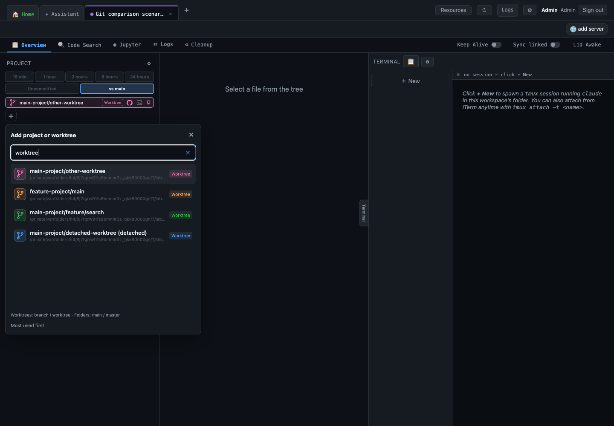
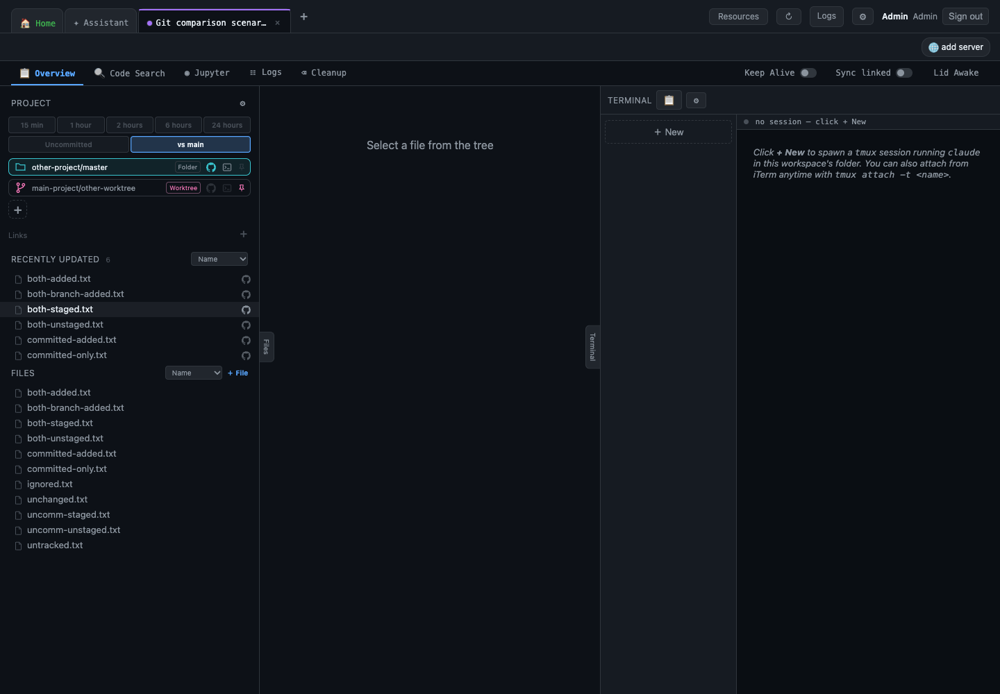
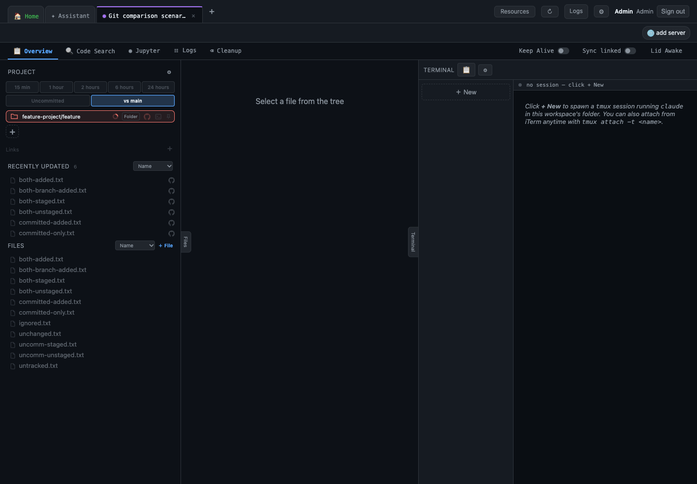
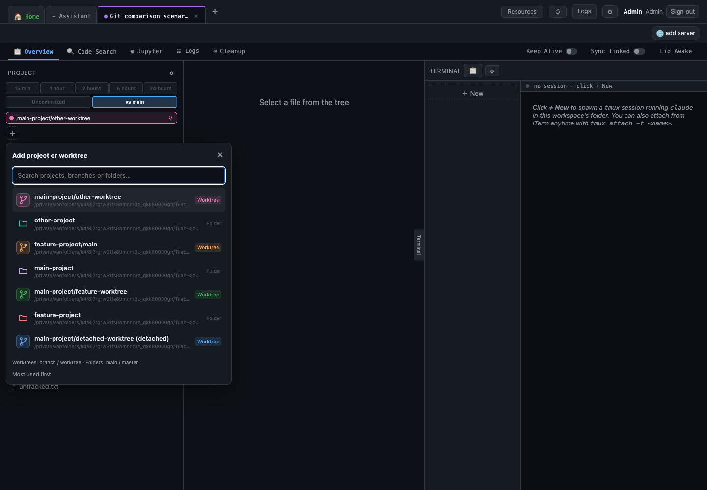
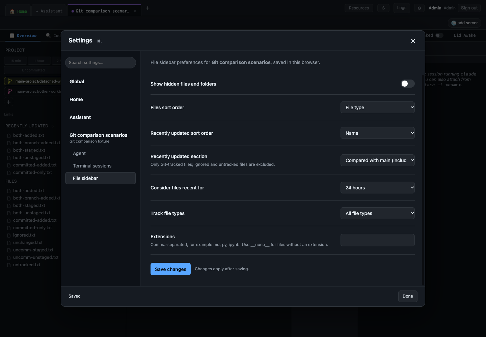
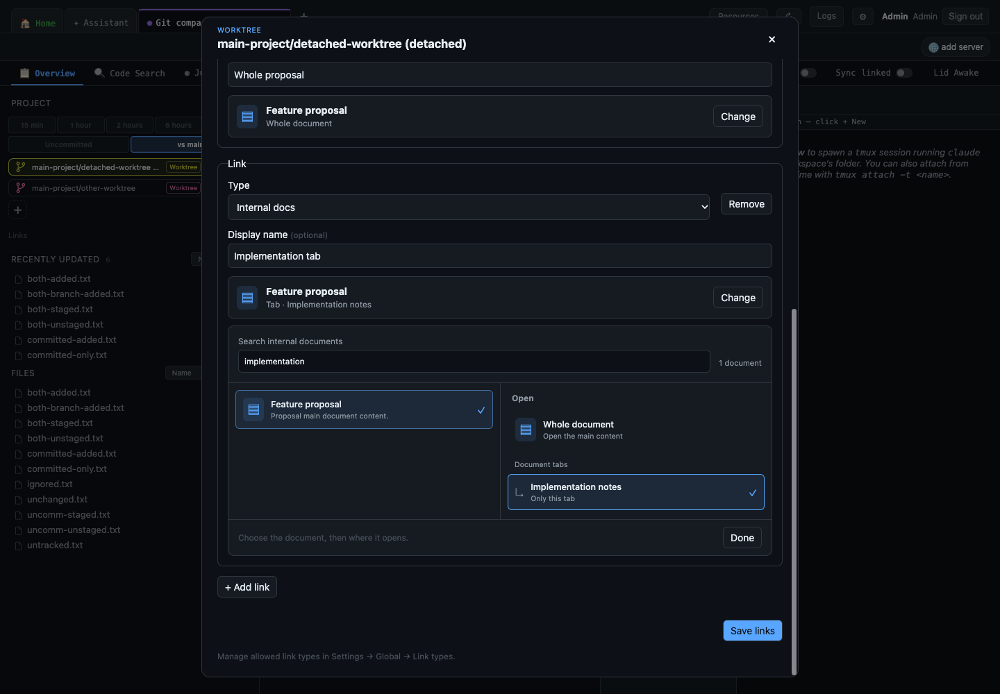
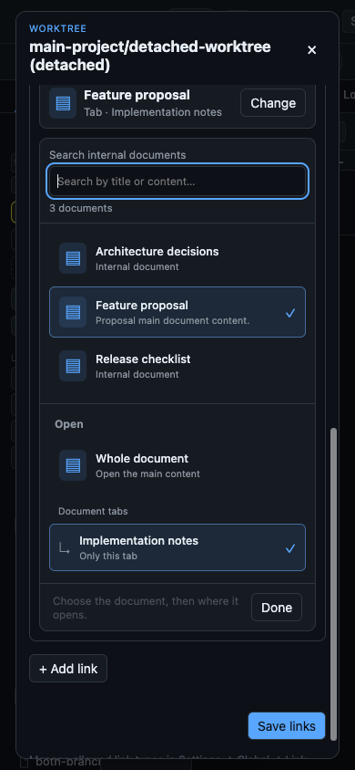
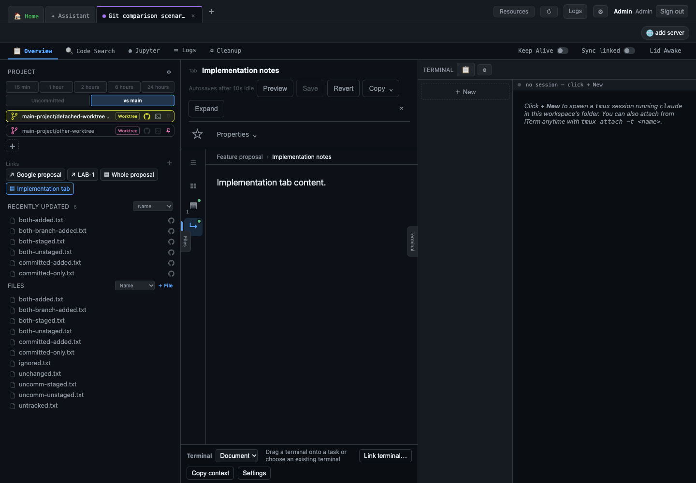

# Sidebar projects, worktrees, and links

Verified on October 1, 2026, using disposable repositories, an isolated Lab
vault/Assistant library, and a separate Chrome profile. All screenshots show the
actual Lab UI.

## New controls

The **+** picker lists projects from the configured projects folder (default
`~/src`), registered custom folders, Git worktrees, and parent folders. Type to
filter by folder, path, or branch; selections sort by usage, then recency. An
absolute or `~/` path can add a folder directly.

The sidebar shows the active folder and pinned folders, one per line, with **+**
on its own line. Each row combines the folder/branch label, kind indicator, Git
history, terminal attachment, and pin. Main folders show their branch too (for
example `Checkpoint/master`). History and terminal attachment are enabled only
in the active row. The duplicate branch and action row below the shortcuts is
removed. Colored folder/branch icons and Folder/Worktree badges distinguish the
main checkout from linked worktrees. Worktrees have a colored branch icon and Worktree badge in the
picker. The search words `branch` / `worktree` restrict results to worktrees;
`main` / `master` restrict results to folders, including parent folders. These
filters combine with other search words, and complete paths remain literal.



Click the pin to keep a shortcut visible; attaching a terminal also pins its exact folder or worktree.
Click a colored folder/branch icon to select from 20 fixed colors. Automatic assignment chooses
an unused color first and reuses the least-used color when the palette is full.
Pins, usage, and colors persist in this browser's workspace settings.



Uncached folder/worktree selections keep the existing tree and viewer visible.
A small spinner appears in the incoming scope row while the root listing and
recent files load offscreen, then both sections replace the tree together.
Outgoing file actions are temporarily blocked; selecting another scope cancels
the pending publication. Failed reads preserve the view and offer **Retry**.
Cached scopes still restore immediately without an artificial delay.





Workspace **File sidebar** Settings contain file preferences only. The duplicate
project list, location editors, Add project control, and Worktree colors section
have been removed. Project defaults and link types remain under Global settings.
Saving file preferences preserves scope selections, pins, colors, and usage.



Active folder/worktree links appear immediately below the controls. **Links +**
opens the editor; double-clicking a sidebar shortcut or the branch label opens
metadata for that exact checkout. Internal links can target an entire document or an individual
nested tab and use Lab's expanded document layout. Entire-document links open the main content
even after a different tab was viewed. External links open the actual site in a
separate pop-out positioned over Lab, avoiding iframe restrictions. The request
runs synchronously on the clicking device, including remote clients, without
OS browser opening. Files, the current document and its unsaved draft, and
existing workspace terminals remain usable. Cmd/Ctrl/Shift-click on a folder
link opens a normal browser tab. Objective Cmd/Ctrl-click retains editable
link details; their explicit Open action uses a pop-out.

The pop-out remains open when Lab navigates. Windows fill almost all of Lab's
width, leave Lab's workspace tabs visible and cascade to expose previous title
bars. Every click opens a new window, including repeated URLs, without a
confirmation. Three cascade positions repeat, starting over on the fourth window.
Use the windows' own controls to activate or close them; there is no resource
registry, native helper or automatic window raising.
The Objectives demo retains all three opening options for comparison.
External service types and icons are inferred from the URL. Use
**Settings → Global → Links and icons** to map self-hosted domains to a service
or upload a custom icon. Links belong to the resolved checkout path and follow it across
workspaces. Internal targets retain library/document/tab IDs and refresh titles
from the source; missing targets remain visible but disabled.

The internal document browser searches titles and content. It shows document
results beside **Whole document** and a nested tab list, with a visible selection
and a compact summary once confirmed. Saved targets can be changed directly.
Search and browsing alone do not dirty metadata. Pending reads block saving;
late responses cannot change the selected document, missing saved tabs require
an explicit replacement, and failed tab reads can retry.







## Three comparison categories

**Uncommitted** compares staged and unstaged tracked changes with `HEAD`.
**vs main** compares the current checkout's content, including current
edits, with the local `main` branch. Neither filter includes untracked/ignored
files. A newly staged file is included.

| Category | Fixture example | Uncommitted | vs main |
| --- | --- | --- | --- |
| In both | `both-staged.txt`, `both-unstaged.txt`, `both-added.txt`, `both-branch-added.txt` | Yes | Yes |
| Only uncommitted | `uncomm-staged.txt`, `uncomm-unstaged.txt`: branch committed a change, then an uncommitted edit restores main's bytes | Yes | No |
| Only vs main | `committed-only.txt`, `committed-added.txt`: committed on this branch and absent from main | No | Yes |

On `main` itself, both filters have the same result. The two exclusive
categories require a branch that differs from main, so the main fixtures show
that expected equality rather than inventing impossible examples.

| Scope | Uncommitted screenshot | vs main screenshot |
| --- | --- | --- |
| Main checkout | [View](main-checkout-uncommitted.png) | [View](main-checkout-local-main.png) |
| Feature checkout | [View](feature-checkout-uncommitted.png) | [View](feature-checkout-local-main.png) |
| Other branch checkout | [View](other-checkout-uncommitted.png) | [View](other-checkout-local-main.png) |
| Main worktree | [View](main-worktree-uncommitted.png) | [View](main-worktree-local-main.png) |
| Feature worktree | [View](feature-worktree-uncommitted.png) | [View](feature-worktree-local-main.png) |
| Other branch worktree | [View](other-worktree-uncommitted.png) | [View](other-worktree-local-main.png) |
| Detached worktree | [View](detached-worktree-uncommitted.png) | [View](detached-worktree-local-main.png) |

## Verification and reproduction

```sh
core/.venv/bin/python scripts/check_sidebar_comparisons.py \
  --output docs/diagnostics/sidebar-comparisons
```

The runner creates its vault/worktrees/library through Lab, checks 28 direct and
cached HTTP comparisons, then clicks all 14 filters in Chrome and verifies exact
rendered file lists. Backend regression tests additionally cover workspace
subdirectories within primary and linked checkouts.

The same UI run checks filtered selection, usage order, active-only visibility,
pin/color persistence after reload, scope preservation on file-preference saves,
a custom link type, whole-document/tab
navigation, per-checkout link isolation, and real terminal creation/attachment
with automatic pins. It deletes only its own disposable terminal. The two
external link clicks reach the OS launcher; the launcher is intercepted in this
fixture process so it opens no external applications. Browser errors: **0**.

Exact evidence is in [results.json](results.json) and
[browser.json](browser.json). All temporary paths/IDs in those reports belonged
to fixtures that were removed after the run.

The combined sidebar/settings/links/terminal regression suite passed **183
tests**, including Chrome navigation and cached DOM performance checks. An
additional branch-name/parent-kind pinning regression verifies that a worktree's
actual branch is retained even when its directory has a different name.

The latest UI refinements passed **34 focused frontend tests**, including real
Chrome Settings checks at desktop and mobile widths. The disposable full UI run
was repeated after those changes, checking all four kind-filter search words,
colored worktree icons, one shortcut per line, and scope preservation on saving
the simplified Settings form.

The metadata-browser follow-up passed **38 focused frontend tests** and the
complete disposable UI run with **0 browser errors**. It verifies native double-click on both active and
inactive pinned shortcuts and on the branch label, content search, empty search
results, editing an existing tab link to the whole document and back, and mobile
layout. Focused Chrome tests also cover keyboard focus, late reads, save guards,
missing saved tabs, and retrying failed document reads.

The inline-controls follow-up passed **37 focused sidebar/terminal frontend
tests** and the complete UI fixture. Native checks assert labels and checkout
kinds for all seven scopes, including a primary `master` checkout and a
`feature/search` worktree in a differently named directory, exactly one active
GitHub/attachment action, and no duplicate branch row. Existing metadata editing,
colors, pins, terminal linking, and mobile document selection still pass.

The loading follow-up passed **87 focused frontend tests**. Chrome checks both
response orders, cancelled folder/worktree reads, failures and retry, outgoing
action guards, and preservation of newer terminal-linked document opens. The
50,000-row fixture retains the under-200ms cached switch target. The full UI run
holds real API reads for three uncached scopes and verifies the previous tree,
viewer, loading indicator, and disabled checkout actions before publication;
all seven scopes, 28 HTTP comparisons, and 14 rendered filters pass with **0
browser errors**.
